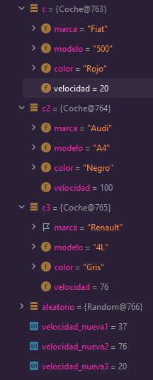
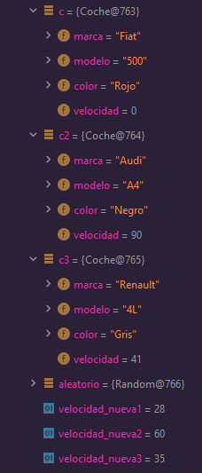

# Tasca 2: Depuración

## 1. ¿Qué hace el método main?

> Crea tres instancias de coche (c, c2 y c3) y nos muestra la distancia de aceleración y de frenado (que se resta de la aceleración).

## 2. Añade un punto de ruptura en la linea 27 para saber el valor de las velocidades y de las instancias de coche

> 

## 3. Añade un punto de ruptura en la linea 46 para saber el nuevo valor de las velocidades y de las instancias de coche

> 
>
> Como podemos ver, las velocidades de las instancias han cambiado con respecto a las velocidades aleatorias.
